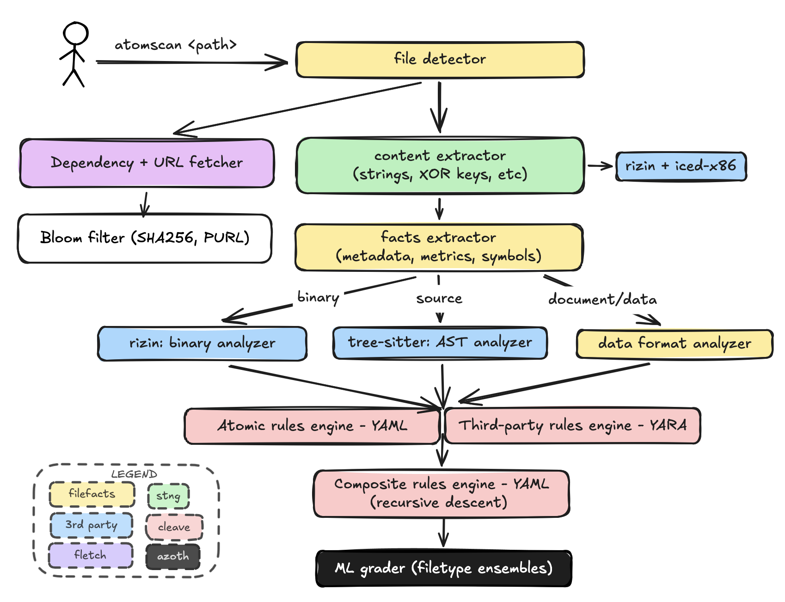

# Atomdrift Scan

[](https://github.com/atomdrift-project/scan/actions/workflows/ci.yml)
[](https://github.com/atomdrift-project/scan/releases/latest)
[](LICENSE)

Atomdrift Scan is a modern ML-based malware scanner designed to detect 0-day attacks against the software supply-chain. 

It's designed to be deterministic, fast, and flexible, and embeddable in any workflow or security tool you have in mind, and can operate against files, archives, URLs, PURLs, or processes. 

As of August 2026, Atomdrift Scan has a [82% 0-day detection rate](https://atomdrift.org/compare/), +18% ahead of any other scanner: commercial or open.

<p align="center">
  
</p>

How does Atomdrift get such great results? First, it covers more ground than any other scanner:

- 100+ supported file formats: from C source to ELF to PDF
- 100,000+ detection rules covering malware on every platform from AIX to iOS to Windows
- 4,000,000+ hashes for known good/badware
- Integrated AST analysis using [tree-sitter](https://tree-sitter.github.io/)
- Automated binary reverse engineering via [rizin](https://rizin.re/)

Most importantly, rules are constantly refreshed using reinforcement learning against new samples, blogs, and technical articles, resulting in ~1000 updated rules daily.

## Install

If you are an a UNIX-flavored host (macOS, Linux, BSD, Solaris, illumos, Android):

```bash
curl -fsSL https://install.atomdrift.org/scan.sh | sh
```

If you are on Windows:

```powershell
irm https://install.atomdrift.org/scan.ps1 | iex
```

Or, if you have [Rust](https://rust-lang.org/) installed and just want to build it from source:

```shell
make install
```

If deeper binary analysis is required, you should also install
[7-Zip](https://7-zip.org/), [rizin](https://rizin.re/), [upx](https://upx.github.io/), and [innoextract](https://github.com/dscharrer/innoextract).

On Windows, using winget:

```powershell
winget install --exact --id 7zip.7zip
winget install --exact --id Rizin.Rizin
winget install --exact --id UPX.UPX
winget install --exact --id dscharrer.innoextract
```

On Unix-like systems, install upstream 7-Zip (`brew install sevenzip`, `apt install 7zip`) rather than `p7zip` — its `7z` cannot read APFS, so `.dmg` contents go unscanned.

## Usage

```bash
# Scan a file, directory, or archive recusively:
atomscan ./project
atomscan release.tgz

# Fetch a package from its registry and scan it.
atomscan purl npm/left-pad@1.3.0

# Fetch and scan a URL.
atomscan url https://example.com/download

# EXPERIMENTAL: Scan running process executables, or triage the wider host
atomscan ps
atomscan sys

# JSON output for programmatic access
atomscan -f json ./project
```

Exit codes make CI integration trivial:

- `0`: all samples are benign
- `1`: hostile sample detected
- `2`: suspicious sample detected
- `3`: analysis error
- `4`: the rule set was incomplete — the scan ran with fewer rules than the
  trait set defines, so anything short of hostile proves nothing. Re-run it.

## How it works



1. [stng](https://github.com/atomdrift-project/stng) extracts content, even if obfuscated
2. [cleave](https://github.com/atomdrift-project/cleave) unpacks containers and extracts capabilities
3. The report is converted into a standardized feature vector, standardized across file types.
4. [azoth](https://github.com/atomdrift-project/azoth) LightGBM model ensembles score the sample.

### Networking and privacy

atomscan will never send telemetry data. It will however reach out to the Internet for 2 reasons:

- **rule updates**: every 24h, can be disabled using `--no-update` or `SCAN_NO_UPDATE_CHECK=1`
- **dependency fetching**: to detect if a benign package depends on downloading a compromised package or  payload. Set `--fetch=none` to prevent this.

## Tune the false-positive level

Unlike other malware scanners, Atomdrift allows you to adjust sensitivity in terms of an acceptable false-positive level using the `-l` flag:

* `-l0`: tight, sets the confidence cutoff to a point where no false-positives have been observed.
* `-l25`: the default shipping point: 25 false-positives per 100 million files.
* `-l1000`: loose, roughly 1 false positive per 100,000 files.

NOTE: For file formats where we don't have 100 million samples, the observed false-positive rate may be up to 5-6X the requested level. YMMV.

Raw `--threshold-hostile` and `--threshold-suspicious` overrides are available
for users who want to micromanage probability thresholds directly, but these numbers are not guaranteed to be stable, and these flags cannot be combined with `-l`.


### Optional local LLM (interpretation)

For additional interpretation, users can provide access to an LLM via the `--llm` flag. This flag serves two purposes:

* Provides a large-language model text interpretation of the results
* Steer edge cases based on agreement/disagreement with the ML model ( p to 33%)

By default, atomscan sends the interpreted evidence (not the original file) to `http://localhost:8000/v1` - to be used with a local service like Ollama or vLLM; but it can also be setup to use a remote service like Claude, ChatGPT, or DeepSeek.

No model is hardcoded: unless you pass `--llm-model`, atomscan asks the endpoint which models it serves and uses the largest one it lists. We recommend serving `Qwen/Qwen3.8-27B`.

```bash
atomscan --llm ./project
atomscan --llm http://model-host:8000/v1 --llm-model my-model ./project
```

## Coverage

The scanner recognizes more than 100 file and container types. Representative
coverage includes:

| Category | Formats |
| --- | --- |
| **Binaries and bytecode** | Mach-O, ELF, PE, WebAssembly, Android DEX, Java `.class`, Python `.pyc`, BEAM |
| **Source** | Python, JavaScript, TypeScript, Go, Rust, Java, C, C++, C#, Ruby, PHP, Perl, Lua, Swift, Objective-C, Kotlin, Scala, Groovy, Zig, Elixir, Clojure, Shell, PowerShell, Batch, VBScript, AppleScript, JCL |
| **Build, manifest, and lock files** | package.json, package-lock.json, Cargo.toml, Cargo.lock, pyproject.toml, requirements.txt, Poetry, Pipenv, Composer, Yarn, pnpm, Go modules, binding.gyp, GitHub Actions, systemd units, Makefile, Dockerfile |
| **Archives and disk images** | ZIP, TAR, gzip, bzip2, XZ, zstd, 7-Zip, RAR, CAB, ASAR, DMG, ISO |
| **Packages and containers** | deb, rpm, APK, npm, wheel, egg, sdist, gem, crate, conda, NuGet, IPA, CRX, XPI, VSIX, OCI/Docker images, FreeBSD, Arch, Void, and Gentoo packages |
| **Documents and data** | OLE2, OOXML, OpenDocument, PDF, RTF, Markdown, HTML, XML, SVG, plist, JPEG, PNG, LNK, CHM, Python pickle |

The rule set includes platform-specific behaviors for Linux, macOS, Windows,
Android, iOS, the BSDs, AIX, Solaris, QNX, z/OS, ESXi, OpenWrt, VxWorks,
RouterOS, FortiOS, PAN-OS, IOS-XE, Junos, NetScaler, and Ivanti appliances.

The default build matrix covers Linux, macOS, FreeBSD, OpenBSD, NetBSD, illumos, Solaris, and Windows across several CPU architectures. Test depth
varies by target; see the [build workflow](.github/workflows/build.yml) for the
current matrix.

## Documentation

- [Integration guide](docs/INTEGRATION.md) — CLI, server, worker, exit codes,
  and deployment choices
- [JSON report schema](docs/JSON.md) — machine-readable output fields
- [Server API](docs/SERVER_API.md) — long-running HTTP service
- [Workers](docs/WORKERS.md) — distributed scanning with hopper
- [Dependency behavior](docs/DEPENDENCIES.md) — fetched dependency graph and
  provenance

## Related projects

- [cleave](https://github.com/atomdrift-project/cleave) — capability extraction
  and static analysis
- [azoth](https://github.com/atomdrift-project/azoth) — model weights,
  thresholds, and feature specification
- [hopper](https://github.com/atomdrift-project/hopper) — distributed work queue
- [Atomdrift Lab](https://lab.atomdrift.org/) — free sample analysis

## License

Atomdrift Scan is available under the [Apache License 2.0](LICENSE).

All contributions welcome!
