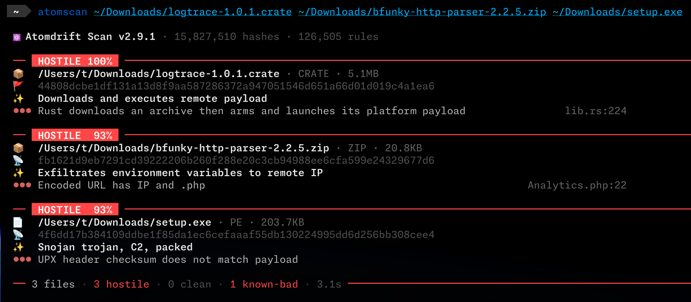

<p align="center">
  
</p>

# litmus

Context-free malware detection. Classifies a file, directory, or running process as `hostile`, `suspicious`, or `benign`, and shows which behaviors drove the call — no signatures, no reputation lookups, no network round-trips.

<p align="center">
  
</p>

## How it works

litmus runs each sample through [cleave](https://codeberg.org/atomdrift/cleave) to extract capabilities (50,000+ rules mapped to [MBC](https://github.com/MBCProject/mbc-markdown) and [ATT&CK](https://attack.mitre.org/)), then scores them with **azoth**, our gradient-boosted tree model (trained with LightGBM, shipped as ONNX) for context-free malware detection. Every verdict ships with a SHAP-ranked list of the capabilities that drove the score.

CPU-only inference. No GPU, no network, no telemetry. Same weights on a laptop, CI runner, or fleet.

## Install

```bash
brew tap atomdrift/tap https://codeberg.org/atomdrift/homebrew-tap.git
brew install litmus
```

Or from source: `git clone https://codeberg.org/atomdrift/litmus.git && cd litmus && make install`.

Optional: [rizin](https://github.com/rizinorg/rizin) for disassembly, [upx](https://github.com/upx/upx) for unpacking. Runs on illumos, OpenBSD, FreeBSD, Linux, and macOS.

## Usage

```bash
litmus suspect.tgz                       # one sample
litmus /srv/npm-mirror                   # recursive; archives unpacked
litmus --format json --show all pkg/     # JSONL for pipelines
litmus ps                                # classify running processes
litmus -0 release.tgz                    # zero false positives; strictest
litmus --loose release.tgz               # level 10: least noisy
litmus -9 release.tgz                    # paranoid: catch the long tail (L90)
litmus -l 50 release.tgz                 # any level 0-100 via -l/--level (L50 is the default)
```

Sensitivity is on the per-100M-benigns scale: `-0` through `-9` for the round-decade shorthand (L0, L10, L20, ..., L90), or `-l <N>` / `--level <N>` for any integer in `0..=100`. Default is L50 (= 50 FP per 100M ≡ 0.5 FP/M). Lower numbers are stricter. For exact cutoffs use `--threshold-hostile` / `--threshold-suspicious`. `--model-dir` swaps in a custom model bundle.

Exit codes: `0` clean, `1` hostile, `2` suspicious, `3` error.

## Modes

- `litmus <path>` — CLI scan
- `litmus --format json` — JSONL output, full cleave report attached ([schema](docs/JSON.md))
- `litmus serve` — HTTP API; loopback default, CIDR allowlist, bounded concurrency, RSS ceiling that rejects before the box swaps ([API reference](docs/SERVER_API.md))
- `litmus worker` — pulls jobs from a [hopper](https://codeberg.org/atomdrift/hopper) queue with SHA256-verified local paths ([worker guide](docs/WORKERS.md))

Models and rules are plain git repos; `--update` pulls new versions on demand.

## Documentation

- [Integration guide](docs/INTEGRATION.md) — pick CLI, server, or worker for your volume
- [JSON report schema](docs/JSON.md) · [Server API](docs/SERVER_API.md) · [Workers](docs/WORKERS.md)

## Related

- [cleave](https://codeberg.org/atomdrift/cleave) — the capability analyzer underneath
- [azoth](https://codeberg.org/atomdrift/azoth) — model weights, thresholds, and feature spec
- [hopper](https://codeberg.org/atomdrift/hopper) — distributed work queue
- [Atomdrift Lab](https://lab.atomdrift.org/) — submit samples for free analysis

## License

Apache-2.0
