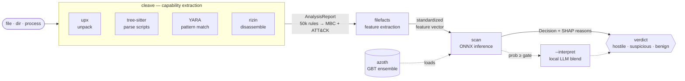

<p alig
    n="center">
  
</p>

# Atomdrift Scan

Atomdrift Scan is an embeddable open-source malware scanner, tuned for open-source ecosystems, and designed to catch supply-chain attacks no matter the file format: ELF, Ruby, Python, Shell, PHP, C, Go, PE, whatever (we extract 95+ different filetypes!)

AS is designed to replace proprietary scanners such as socket.dev, ReversingLabs, and Aikido, as well as legacy open-source
scanners such as ClamAV and malcontent. To fight fire with fire, AS makes use of local AI models - but ones that are designed to be explicitly deterministic and designed to run on any hardware or operating system.

Unlike most scanners, you get to pick your false-positive level, based on predicted occurrence over 100 million samples. Paranoid about your CI pipeline? use `ascan -l500 <files>`; don't want to bombard the SOC with alerts? use `ascan -l0`. 

AS is in active development using the following architectures - chances are if you are elsewhere - it'll still work, but PRs welcome.

* Linux [x86-64]
* macOS [arm64]
* FreeBSD [arm64, x86-64]
* OpenBSD [x86-64]
* OmniOS/illumos [x86-64]

Atomdrift's core values are: privacy-first, local-only, fast, and comprehensive.

<p align="center">
  
</p>

## How it works

Atomdrift Scan is a multi-stage analyzer bringing together the best that open-source has to offer for reverse-engineering
binaries and source code. 

AS is able to cover as much ground as it does by expressing the AI model in terms of a YAML-based expert system with over 75,000 rules, analyzing using a large ensemble of LightGBM ML models. AS also supports the use of local GPU-based analysis via OpenAI-compatible endpoints [vLLM, for example] for additional accuracy and interpretation, but that's entirely optional.



## Dependencies

* Rust 1.96 or higher
* upx [optional, recommended]
* rizin [optional, recommended]
* innoextract [optional, recommended]

## Install

For Linux and macOS users using Homebrew:

```bash
brew tap atomdrift/tap https://codeberg.org/atomdrift/homebrew-tap.git
brew install atomdrift-scan
```

For everyone else, source compiles are trivial:

```bash
git clone https://codeberg.org/atomdrift/scan.git
cd scan
make install
```

## Usage

```bash
ascan fs /bin/                           # recursive; archives unpacked
ascan ps                                 # classify running processes
```

By default, ascan is tuned for 50 false-positives per 100-million files, tune it for your use case using -l <X-per-100M>. To be ultra conservative and avoid any likelihood of false-positive, use:

```bash
ascan -l 0 /sbin/sulogin
```

If you only care about rules for a particular platform, say macos or JunOS; use `--platform` to mask everything else out. Nothing is more annoying than seeing a Windows-specific alert on your ArchLinux CI pipeline.

## Documentation

- [Integration guide](docs/INTEGRATION.md) — pick CLI, server, or worker for your volume
- [JSON report schema](docs/JSON.md) · [Server API](docs/SERVER_API.md) · [Workers](docs/WORKERS.md)

## Related

- [cleave](https://codeberg.org/atomdrift/cleave) — the capability analyzer underneath
- [azoth](https://codeberg.org/atomdrift/azoth) — model weights, thresholds, and feature spec
- [hopper](https://codeberg.org/atomdrift/hopper) — distributed work queue
- [Atomdrift Lab](https://lab.atomdrift.org/) — submit samples for free analysis

## License

Apache-2.0
