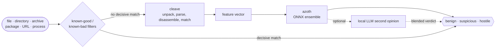

# Atomdrift Scan

[](https://github.com/atomdrift-project/scan/actions/workflows/ci.yml)
[](https://github.com/atomdrift-project/scan/releases/latest)
[](LICENSE)

Atomdrift Scan is an open-source malware and supply-chain scanner for files,
directories, archives, packages, URLs, and running processes. The `atomscan`
CLI combines static analysis with local, CPU-based ML to classify code as
**benign**, **suspicious**, or **hostile**.

No cloud scanner, API key, GPU, or sample upload is required. Analysis and
model inference run on your machine. Given the same input and installed
bundles, results are deterministic and suitable for a developer workstation,
CI gate, or self-hosted scanning service.

<p align="center">
  
</p>

## Why Atomdrift Scan?

- **Designed for software supply chains.** Inspect source, binaries, package
  manifests, lockfiles, archives, and the external artifacts they reference.
- **Broad, format-aware analysis.** Recognizes more than 100 code, package,
  archive, document, and binary formats instead of treating every file as an
  opaque byte stream.
- **Private and self-hostable.** Samples are not uploaded by default; the scan
  engine and ONNX models run locally.
- **A policy you can tune.** Set an operating level in expected false positives
  per 100 million benign files, rather than guessing at a generic “sensitivity.”
- **Built for automation.** Stable exit codes, NDJSON output, an HTTP server,
  and distributed workers cover everything from a pre-commit check to a scan
  farm.
- **Explainable results.** Findings include the capabilities and behaviors that
  contributed to a verdict, not only a score.

## Install

### macOS, Linux, BSD, and illumos

```bash
curl -fsSL https://install.atomdrift.org | sh
```

The installer works out your platform, downloads the matching release binary,
verifies its SHA-256 checksum and — when the GitHub CLI is available — its
signed build provenance, then installs it into a directory on your `PATH`. On
macOS it hands the job to Homebrew when Homebrew is present. A platform with no
published binary falls back to a source build. Re-run it to upgrade; an install
that is already current is left alone.

Options go after `sh -s --`:

```bash
curl -fsSL https://install.atomdrift.org | sh -s -- --dir ~/bin --method binary
curl -fsSL https://install.atomdrift.org | sh -s -- --version 2.5.0
```

`--method binary` skips Homebrew and takes the prebuilt binary, `--no-tools`
skips the optional analysis tool check, and `--help` lists the rest. Piping a
script into a shell is worth being uneasy about, so read it first if you would
rather: that URL serves [install.sh](install.sh) unchanged.

### Windows

```powershell
irm https://install.atomdrift.org/ps1 | iex
```

Installs into `%LOCALAPPDATA%\Programs\atomscan\bin` and puts it on your user
`PATH`, with no administrator rights required. Windows binaries are not
published yet, so this builds from source and needs Git, Rust, and the Visual
Studio C++ build tools; the script names any of them it cannot find.

### Homebrew on macOS or Linux

```bash
brew install atomdrift-project/tap/scan
```

The Homebrew formula builds Atomdrift Scan from source and installs the
recommended `rizin` and `upx` analysis tools. The first build can take a while
because the Rust analysis stack is large.

### Build from source

Source builds require Git, Make, a C/C++ toolchain, and Rust 1.94 or newer.
Install [Rust with rustup](https://rustup.rs/), then run:

```bash
git clone https://github.com/atomdrift-project/scan.git
cd scan
make install
```

`make install` creates an optimized build and installs the command as
`atomscan`, normally under `~/.cargo/bin`. Ensure that directory is on your
`PATH`. Run `make uninstall` from the checkout to remove it.

For deeper binary analysis, also install
[rizin](https://rizin.re/) and [upx](https://upx.github.io/).
[innoextract](https://github.com/dscharrer/innoextract) is optional and adds
Inno Setup extraction.

### First run

Verify the installation and scan a package:

```bash
atomscan --version
atomscan suspicious-package.tgz
```

The first scan downloads the open model, rule, and bloom-filter bundles. Later
scans refresh bundles when they are more than 24 hours old.

## Quick start

```bash
# Scan a file, directory, or archive. Directories are recursive and archives
# are unpacked automatically.
atomscan ./project
atomscan release.tgz

# Fetch a package from its registry and scan it.
atomscan purl npm/left-pad@1.3.0

# Fetch and scan a URL.
atomscan url https://example.com/download

# Scan running process executables, or triage the wider host.
atomscan ps
atomscan sys

# Emit one JSON object per scanned file.
atomscan -f json ./project
```

A scan exits `0` when everything is benign, `1` when anything is hostile, `2`
when something is suspicious but nothing is hostile, and `3` on analysis
errors. This makes a basic CI gate straightforward:

```bash
atomscan ./artifact
```

### Network and privacy behavior

Files are analyzed locally and are not uploaded unless you explicitly
configure a hopper with `--hopper`. Be aware that the CLI does make outbound
requests by default:

- the first run downloads models, rules, and bloom filters;
- stale bundles are refreshed automatically; and
- references found in scanned files—including declared dependencies, package
  install commands, and download URLs—are fetched and scanned recursively.

After the initial bundles are installed, disable the separate release notice as
well for a fully offline scan:

```bash
SCAN_NO_UPDATE_CHECK=1 atomscan --no-update --fetch=none ./project
```

Use `--fetch=deps`, `--fetch=packages`, or `--fetch=urls` to limit active
reference scanning. See `atomscan --help` for depth, age, size, and count limits.

## Tune the false-positive level

`-l N` selects a calibrated operating point expressed as expected false
positives per 100 million benign files. Higher levels find more but are noisier;
lower levels are better suited to hard blocking gates.

```bash
atomscan -l 0 ./artifact       # strictest: minimize false positives
atomscan ./artifact            # use the installed model bundle's default
atomscan -l 5000 ./artifact    # more sensitive, with more alerts
```

Raw `--threshold-hostile` and `--threshold-suspicious` overrides are available
for users who want to manage probability thresholds directly. They cannot be
combined with `-l`.

## How it works

Atomdrift Scan uses several local analysis stages:

1. [cleave](https://github.com/atomdrift-project/cleave) unpacks containers and
   extracts capabilities from binaries and source with tools including Rizin,
   tree-sitter, YARA, and UPX.
2. The report is converted into a standardized feature vector.
3. [azoth](https://github.com/atomdrift-project/azoth) ONNX model ensembles
   select a route for the file type and produce a probability and explanation.
4. The configured false-positive level turns that result into a benign,
   suspicious, or hostile verdict.



Run `atomscan version` to see the exact rule, bloom-filter, and model inventory
installed on your machine.

### Optional local LLM

`--llm` sends evidence—not the original file—to an OpenAI-compatible endpoint
for a second opinion and blends the result with the ML verdict. With no target,
it uses `http://localhost:8000/v1`; vLLM is one compatible server.

```bash
atomscan --llm ./project
atomscan --llm http://model-host:8000/v1 --llm-model my-model ./project
```

This feature is optional. The default scanner needs neither an LLM nor a GPU.

## Coverage

The scanner recognizes more than 100 file and container types. Representative
coverage includes:

| Category | Formats |
| --- | --- |
| **Binaries and bytecode** | Mach-O, ELF, PE, WebAssembly, Android DEX, Java `.class`, Python `.pyc`, BEAM |
| **Source** | Python, JavaScript, TypeScript, Go, Rust, Java, C, C++, C#, Ruby, PHP, Perl, Lua, Swift, Objective-C, Kotlin, Scala, Groovy, Zig, Elixir, Clojure, Shell, PowerShell, Batch, VBScript, AppleScript, JCL |
| **Build, manifest, and lock files** | package.json, package-lock.json, Cargo.toml, Cargo.lock, pyproject.toml, requirements.txt, Poetry, Pipenv, Composer, Yarn, pnpm, Go modules, binding.gyp, GitHub Actions, systemd units, Makefile, Dockerfile |
| **Archives and disk images** | ZIP, TAR, gzip, bzip2, XZ, zstd, 7-Zip, RAR, CAB, ASAR, DMG, ISO |
| **Packages and containers** | deb, rpm, APK, npm, wheel, egg, sdist, gem, crate, conda, NuGet, IPA, CRX, XPI, VSIX, OCI/Docker images, FreeBSD, Arch, Void, and Gentoo packages |
| **Documents and data** | OLE2, OOXML, OpenDocument, PDF, RTF, Markdown, HTML, XML, SVG, plist, JPEG, PNG, LNK, CHM, Python pickle |

The rule set includes platform-specific behaviors for Linux, macOS, Windows,
Android, iOS, the BSDs, AIX, Solaris, QNX, z/OS, ESXi, OpenWrt, VxWorks,
RouterOS, FortiOS, PAN-OS, IOS-XE, Junos, NetScaler, and Ivanti appliances.

The build matrix covers Linux, macOS, FreeBSD, OpenBSD, NetBSD, DragonFly BSD,
and illumos across several CPU architectures. Test depth varies by target; see
the [build workflow](.github/workflows/build.yml) for the current matrix.

## Documentation

- [Integration guide](docs/INTEGRATION.md) — CLI, server, worker, exit codes,
  and deployment choices
- [JSON report schema](docs/JSON.md) — machine-readable output fields
- [Server API](docs/SERVER_API.md) — long-running HTTP service
- [Workers](docs/WORKERS.md) — distributed scanning with hopper
- [Dependency behavior](docs/DEPENDENCIES.md) — fetched dependency graph and
  provenance

## Related projects

- [cleave](https://github.com/atomdrift-project/cleave) — capability extraction
  and static analysis
- [azoth](https://github.com/atomdrift-project/azoth) — model weights,
  thresholds, and feature specification
- [hopper](https://github.com/atomdrift-project/hopper) — distributed work queue
- [Atomdrift Lab](https://lab.atomdrift.org/) — free sample analysis

Issues and pull requests are welcome in the
[GitHub repository](https://github.com/atomdrift-project/scan).

## License

Atomdrift Scan is available under the [Apache License 2.0](LICENSE).
